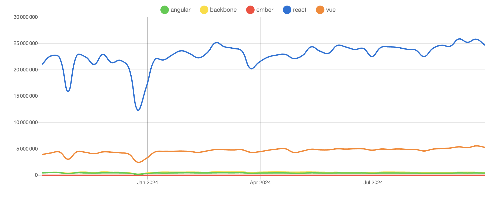

# 📚 Projet de Veille Technologique : **React**

## 👨‍💻 Contexte de l'exercice

Cet exercice est réalisé dans le cadre d'un cours de veille technologique en première année de master en développement fullstack. Le but est de mettre en place un projet de veille pour analyser les tendances actuelles autour d'une technologie spécifique

🔗 [Lien vers le sujet du TP](https://github.com/kevinniel/M1-MDS-2425-Veille)

## 👨‍💻 Justification du choix de la technologie

React est un framework JavaScript très populaire, créé par Facebook, qui permet de construire des interfaces utilisateur dynamiques et performantes. Actuellement, il est l'un des frameworks les plus utilisés et appréciés par la communauté de développeurs.

- React est actuellement l'un des frameworks front-end les plus populaires, avec une communauté très active et de nombreux projets open-source. Cela signifie qu'on trouve rapidement des solutions en cas de problème et qu'il y a de nombreuses ressources pour apprendre.
- Son écosystème est vraiment riche (Next.js, Gatsby, Redux, React Query...), ce qui permet de construire des applications complètes et scalables. On peut facilement intégrer des librairies tierces pour étendre ses fonctionnalités.
- L'architecture par composants facilite la réutilisation de code et la séparation des préoccupations. C’est super pratique pour développer plus rapidement et mieux structurer le projet.
- Grâce à sa virtual DOM, React optimise les mises à jour de l'interface, ce qui garantit de bonnes performances par rapport à d'autres frameworks où les manipulations du DOM peuvent ralentir l'affichage.
- Avec des outils comme Next.js, on peut rendre nos applications plus performantes pour le SEO en utilisant le rendu côté serveur (SSR). C’est un vrai plus pour les projets où le référencement est important.
- React est déjà adopté par de grandes entreprises comme Facebook, Airbnb et Netflix. C’est un signe que c’est un choix sécurisé pour les projets professionnels de grande envergure.
- Dans mon entreprise, nous avons choisi React car il s'intègre bien avec **Electron** pour créer des applications desktop performantes, tandis que pour les PWA (Progressive Web Apps) de nos clients, nous utilisons uniquement **React**. Cela nous permet d'avoir une seule base de code pour les versions ordinateur et mobile, simplifiant ainsi le développement et la maintenance.

## 🔍 Comparatif des Frameworks JavaScript

Pour justifier le choix de React, voici un comparatif de l'utilisation des principaux frameworks JavaScript en 2023 :

L'image ci-dessus montre que React reste le choix préféré des développeurs en raison de sa flexibilité et de sa large adoption dans la communauté.
